# timer-widget
*Stream Elements* widget for overlays, that is triggered when a redeem is triggered

| 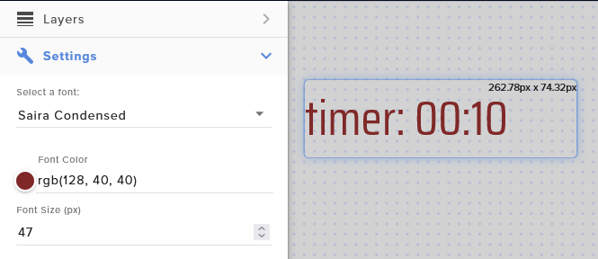 | 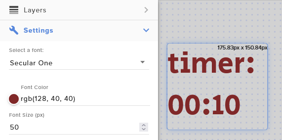 |
|--------------------------------------------------------|--------------------------------------------------------|
|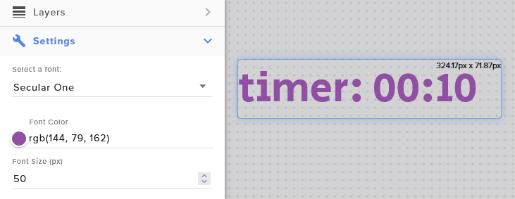| 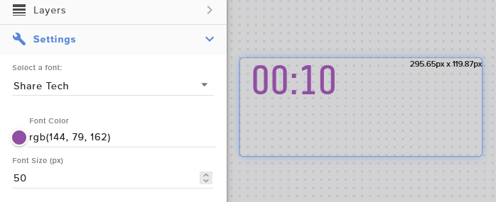                                                       |
## How to use it?
Go to your *Stream Elements* dashboard, and open the overlay you want to include the widget.

1. In the Overlay editor select the add custom widget.
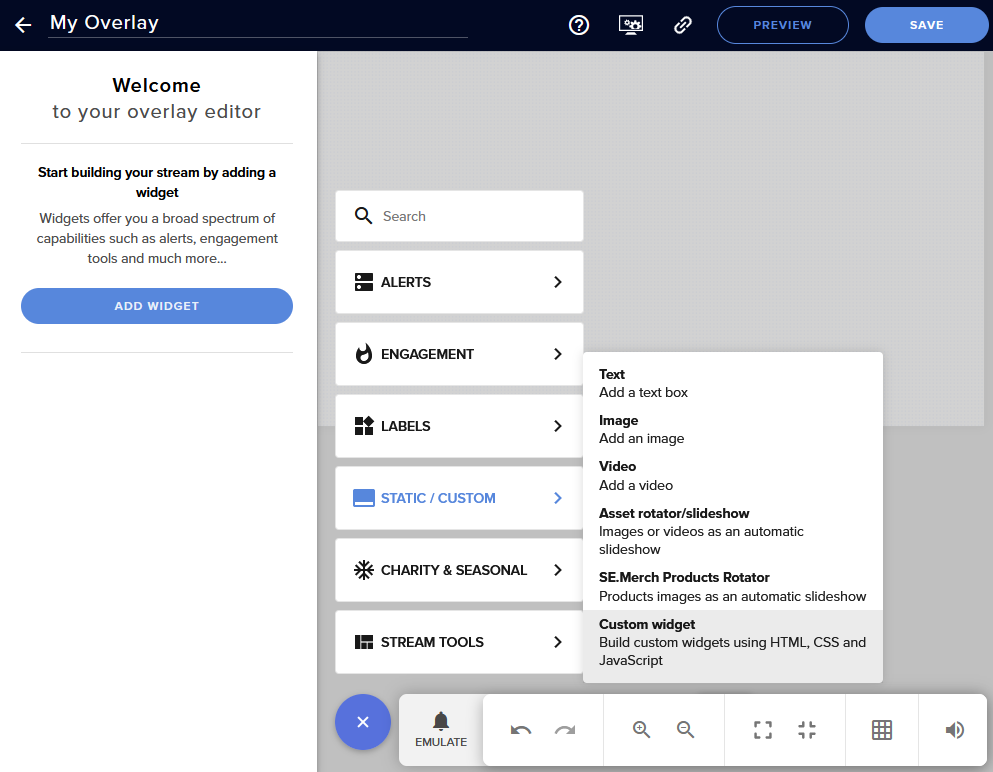

2. Once you have added the Custom Widget you need to open the Editor. 
   - When they widget is selected you will see the Settings in the sidebar. If its collapsed make sure to expand it.
   - Click on Open Editor
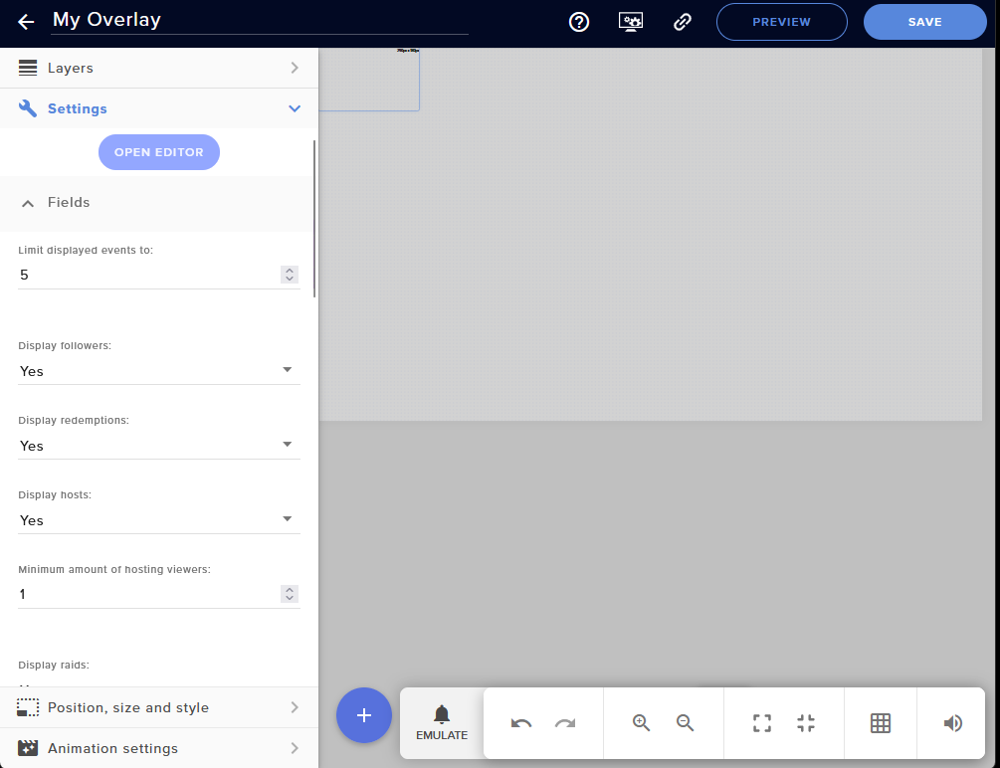

3. Copy the contents of [the widget folder to the editor](widget), you will need to delete what is in the tabs, and copy&paste the content of each file.
   - widget.html should be copied into the HTML tab in the editor. 
   - widget.css should be copied into the CSS tab in the editor.
   - widget.js should be copied into the JS tab in the editor.
   - widget-fields.json should be copied into the Fields tab in the editor.
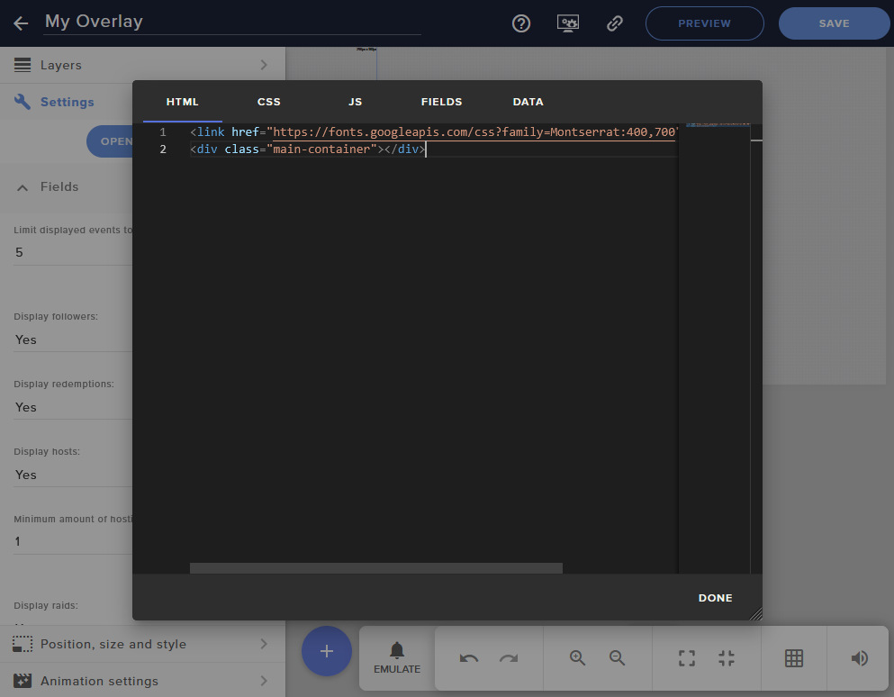
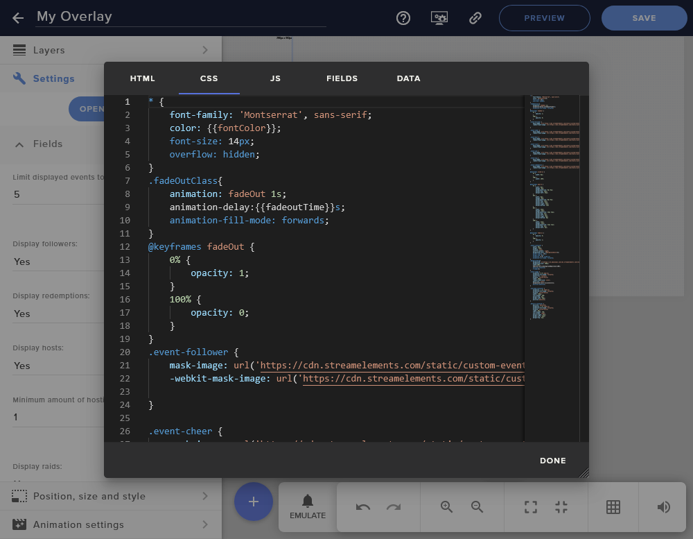
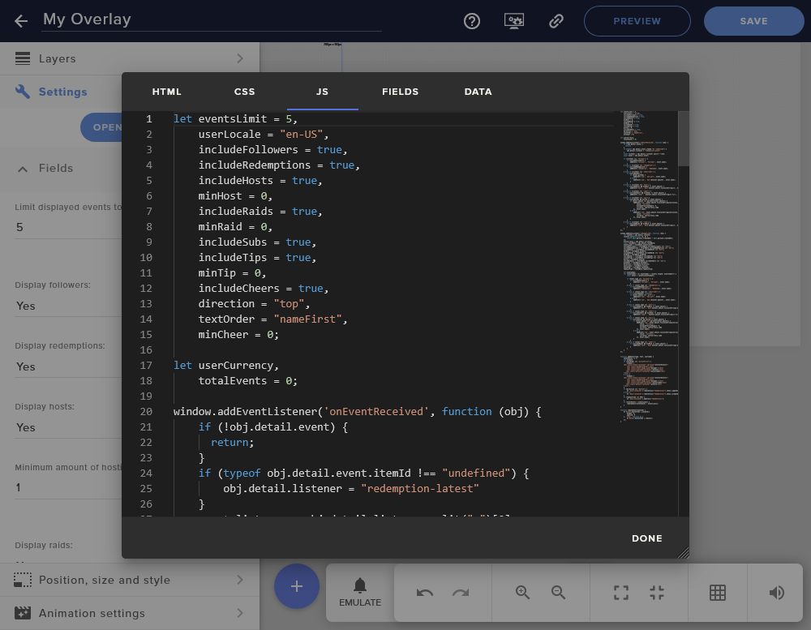
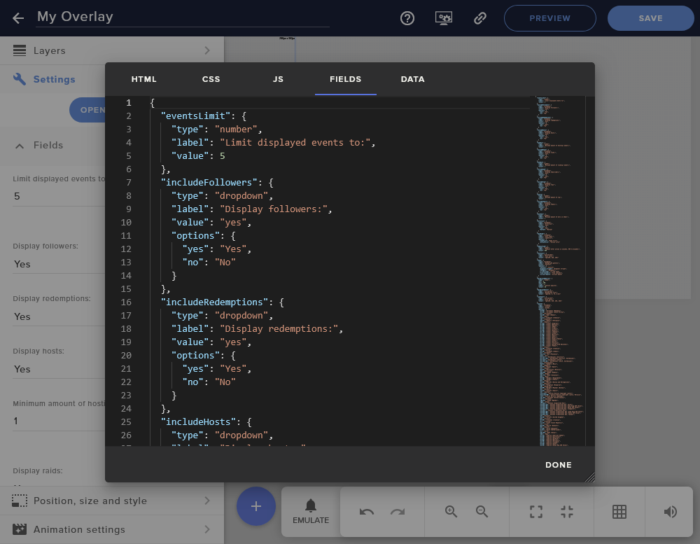

4. Once you click on Done you will see the settings sidebar shows the new fields from the widget.
   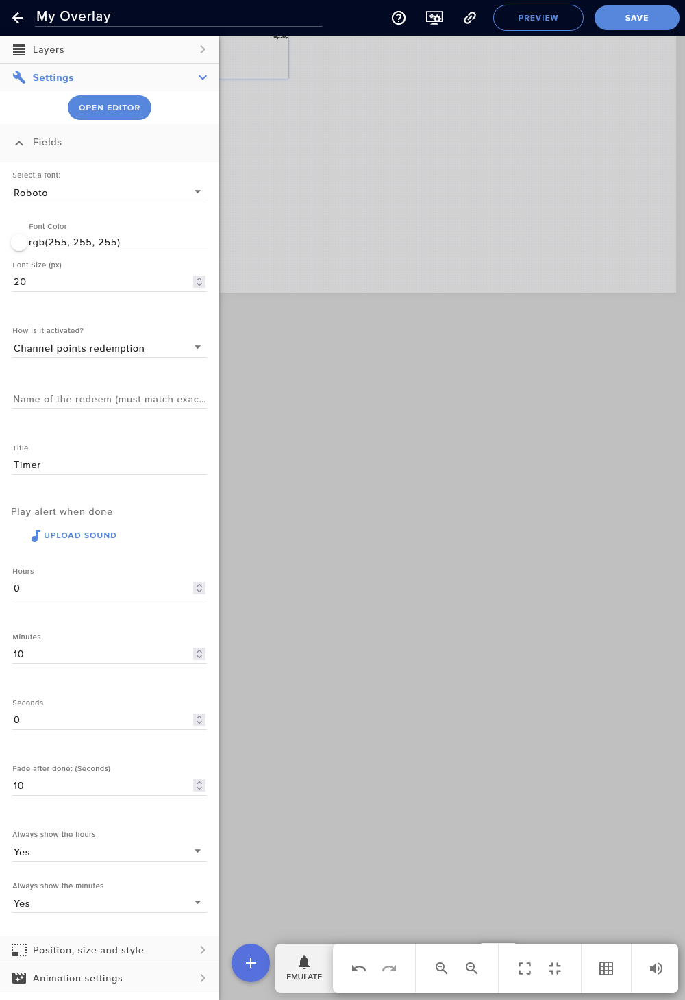
   - Edit the fade timer to 0, so the widget becomes visible
   - Adjust the font, color, and font size to something that works for your overlay. 
   - Adjust the size of the widget so everything fits as you like it.
5. Time to start configuring!

## Widget Fields and configuration

| **Name**                  | **Details**                                                                                                                                                | **Default**          |
|---------------------------|------------------------------------------------------------------------------------------------------------------------------------------------------------|----------------------|
| **Font family**           | Select a font family to use, the widget uses Google fonts, you can select they one you like the most.                                                      | Roboto               |
| **Font color**            | Select the color for the text of the widget.                                                                                                               | White                |
| **Font size**             | Select the size of the text in the widget.                                                                                                                 | 20                   |
| **How is it activated?**  | Maybe for the future, for now it only allows you to trigger the timer with user redeems.                                                                   | Channel point redeem |
| **Name of the redeem**    | The exact name of your redeem as it shows on twitch. This is used to activate the timer,                                                                   | None                 |
| **Title**                 | The title of the timer, it will show next to the countdown, or on top depending on the size of the box. If empty it will not show a title.                 | "Timer"              |
| **Sound Alert**           | When the countdown reaches 0, it will play the sound alert you upload.                                                                                     | None                 |
| **Hours**                 | The number of hours for your timer [0-99999]                                                                                                               | 0                    |
| **Minutes**               | The number of minutes for your timer [0-59]                                                                                                                | 0                    |
 | **Seconds**               | The number of seconds for your timer [0-59]                                                                                                               | 0                    |
| **Fade after done**       | Do you want the timer to vanish after a few seconds of completing? Set it to anything higher than 0. If the fade is set to 0, the timer will always show.  | 15                   |
| **Always show the hours**   | Do you want to see the hours even when the number is 0? Select `Yes`                                                                                     | Yes                  |
| **Always show the minutes** | Do you want to see the minutes even when the number is 0? Select `Yes`                                                                                   | Yes                  |
